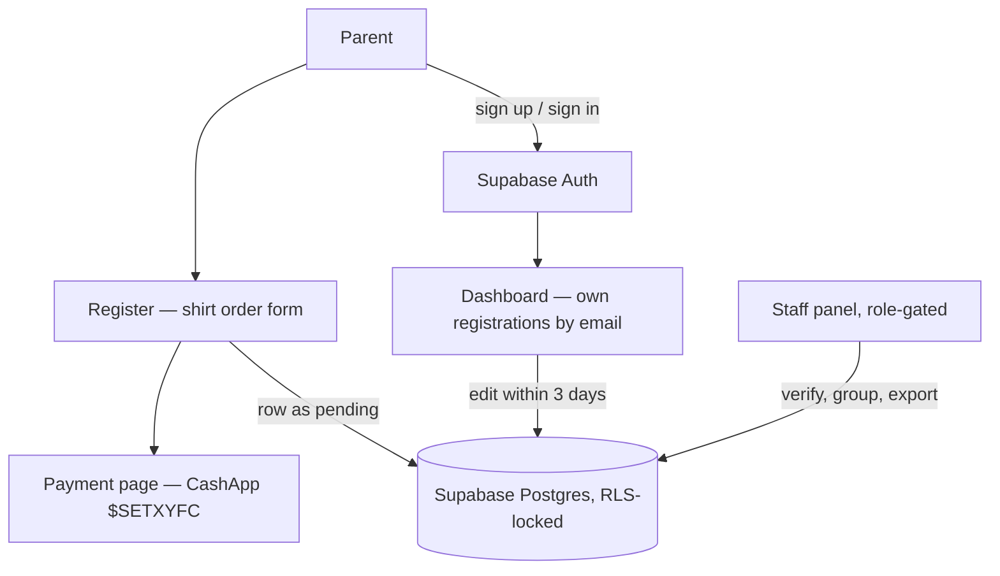

<p align="center">
  
</p>

<h1 align="center">SETX Football</h1>

<p align="center">
  <b>Registration and shirt-order management for SETX Football Camp.</b>
</p>
<p align="center">
  A youth football camp in Southeast Texas — parents sign up and pay by CashApp,<br />
  staff verify and manage the roster. Live at <a href="https://setxfootball.com">setxfootball.com</a>.
</p>

<p align="center">
  
  
  
  
  
  
  
</p>

<br />

## Why SETX Football

Camp registration has to be effortless for a parent on a phone and airtight for the volunteers running check-in. This is the whole camp online: a public marketing site, a registration and shirt-order flow that takes payment over CashApp without forcing an account, and a role-gated staff panel that verifies each payment and works the roster — all on Supabase with row-level security, so parents only ever see their own registrations.

<table width="100%">
  <tr>
    <td width="33%" valign="top">
      <h3 align="center">Register &amp; pay</h3>
      <p align="center">A multi-shirt order form with a live $5-per-shirt total, then CashApp payment to <code>$SETXYFC</code> — no account required to start.</p>
    </td>
    <td width="33%" valign="top">
      <h3 align="center">Parent dashboard</h3>
      <p align="center">Signed-in parents track payment status and edit their registration inside a 3-day window with a live days-remaining countdown.</p>
    </td>
    <td width="33%" valign="top">
      <h3 align="center">Staff panel</h3>
      <p align="center">A role-gated roster with search, family grouping, revenue KPIs, one-toggle payment verification, and CSV export.</p>
    </td>
  </tr>
</table>

<br />

## Stack

| Layer | Technology |
| :--- | :--- |
| UI | React 19 + React Router 7 |
| Build & dev | Create React App (`react-scripts` 5) |
| Styling | Tailwind CSS 3.4 + the vendored `@bradley-t-t/sunday-design-system` preset |
| UI & SEO | `framer-motion` · `lucide-react` · `recharts` · `react-helmet-async` |
| Backend | Supabase — Postgres, Auth, Row-Level Security |
| Data access | `AuthService` + `RegistrationService`, returning `{ data, error }` tuples |
| Analytics | First-party, cookieless beacon (`src/library/sunday-analyzer`) |
| Delivery | Static single-page build |

The design system ships as a committed tarball under `vendor/` and is referenced from `package.json` as `file:./vendor/…tgz`, so installs and CI builds resolve it without a registry.

## Getting started

```bash
npm install           # the design system is vendored, so this resolves offline
npm start             # dev server at localhost:3000
CI=true npm run build # production build gate
```

Create a `.env` with the Supabase credentials — the client throws on startup if either is missing:

| Variable | Purpose |
| :--- | :--- |
| `REACT_APP_SUPABASE_URL` | Supabase project URL. |
| `REACT_APP_SUPABASE_ANON_KEY` | Supabase publishable key for the browser client. |

Always gate the build with `CI=true` — Create React App treats warnings as errors under CI, so a plain `npm run build` can pass locally and still fail the deploy.

### Scripts

| Script | Does |
| :--- | :--- |
| `npm start` | Start the CRA dev server. |
| `npm run build` | Production build to `build/`. |
| `npm test` | Jest via `react-scripts` (passes with no suites). |
| `npm run eject` | One-way CRA eject. |

## Routes

| Path | Page | Access |
| :--- | :--- | :--- |
| `/` | Home | Public |
| `/about` | About | Public |
| `/gallery` | Gallery | Public |
| `/sponsors` | Sponsors | Public |
| `/register` | Register | Public |
| `/payment` | Payment instructions | Public |
| `/auth` | Sign in / sign up | Public |
| `/dashboard` | Parent dashboard | Signed in |
| `/staff` | Staff panel | Staff / admin |
| `/privacy` · `/terms` · `/design` | Legal and design reference | Public |

## Architecture



## How it works

- **No component touches Supabase directly.** Every read and write flows through `AuthService` and `RegistrationService`, which return `{ data, error }` tuples; `library/supabaseClient.js` is the single client.
- **Registration lands as `pending`.** The form writes a row to `camp_registrations` and forwards to the payment page with CashApp instructions for the `$SETXYFC` handle.
- **Accounts reconcile by email.** Creating an account (with email verification) lets a parent return to a dashboard that finds their registrations by `parent_email` and exposes an inline edit form for `EDIT_WINDOW_DAYS` (3) after creation.
- **Staff work the same table.** The panel filters by camp year and payment status, groups family registrations, surfaces live revenue KPIs, flips payment `pending` ↔ `paid`, and exports filtered rows to CSV.
- **Roles live in `user_profiles`.** `AuthContext` exposes the user, profile, and `isStaff` / `isAdmin` flags; `ProtectedRoute` gates `/dashboard` and `/staff`.

### Security

- **Row-Level Security** — policies scope `camp_registrations` and `user_profiles` to their owner, with staff/admin read-and-update policies keyed off `user_profiles.role`.
- **Service boundary** — only the two services import the Supabase client, and update/delete queries constrain by both record id and user id.
- **No credential fallbacks** — Supabase config comes only from env vars, and CSV export escapes formula triggers to prevent injection.

## Project structure

```
setxfootball-com/
├── public/                index.html, sitemap, manifest, favicons, sponsors/
├── vendor/                bradley-t-t-sunday-design-system-*.tgz (committed)
└── src/
    ├── app/App.jsx        Client-side route table
    ├── pages/             Home, About, Gallery, Sponsors, Register, Auth,
    │                      Dashboard, StaffPanel, Payment, Privacy, Terms, Design
    ├── components/        nav, footer, marketing sections, routing, seo, brand, layout
    ├── context/           AuthContext.jsx — session state + role flags
    ├── services/          AuthService.js, RegistrationService.js — Supabase access
    ├── hooks/             useStaffRegistrations, useScrollReveal, useCountUp, …
    ├── utils/             constants, helpers, csv, shirtOrders, registrationGrouping
    ├── library/           supabaseClient.js, sunday-analyzer/
    ├── content/           campContent.js
    └── assets/            logo.PNG, images/
```

## License

Copyright (c) 2026 Trenton Taylor. All rights reserved. See [LICENSE.md](LICENSE.md).

<br />

<p align="center">
  <sub>Sign up, pay, and hit the field — SETX Football Camp.</sub>
</p>
