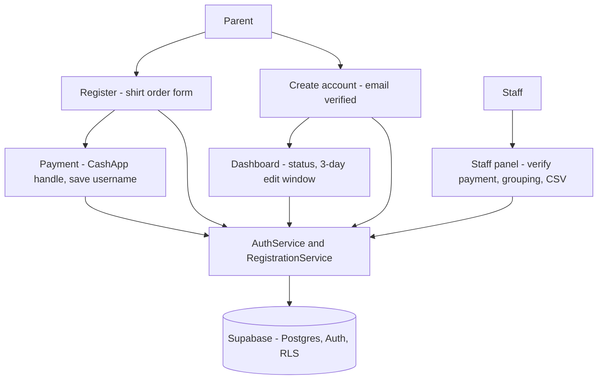

<p align="center"></p>

<h1 align="center">SETX Football</h1>

<p align="center"><b>Registration and shirt-order management for SETX Football Camp.</b></p>
<p align="center">
  A youth football camp in Southeast Texas — parents sign up and pay; staff verify and manage.<br />
  Live at <a href="https://setxfootball.com">setxfootball.com</a>.
</p>

<p align="center">
  
  
  
  
  
  
</p>

---

- **Sign up in one pass** — a multi-shirt order form (size, recipient, camper or family) with a live $5-per-shirt total; no account needed to start.
- **CashApp payment, verified by staff** — parents pay the camp's `$SETXYFC` handle and save their username; staff confirm each payment with a single toggle.
- **Dashboards for both sides** — parents track status and edit within a 3-day window; staff get a role-gated panel with search, family grouping, revenue KPIs, and CSV export.

## Stack

| Layer         | Technology                                                                 |
| ------------- | -------------------------------------------------------------------------- |
| Framework     | React 19 + React Router 7 on Create React App (`react-scripts` 5)          |
| Styling       | Tailwind CSS 3.4 + vendored `@bradley-t-t/sunday-design-system`             |
| Icons / SEO   | `lucide-react` · `react-helmet-async`                                       |
| Backend       | Supabase — PostgreSQL, Auth, Row-Level Security                             |
| Data access   | `AuthService` + `RegistrationService` returning `{ data, error }` tuples    |
| Hosting       | Vercel                                                                      |

The design system ships as a committed tarball under `vendor/` and is referenced from `package.json` as `file:./vendor/…tgz`, so installs and Vercel builds resolve it without a registry.

## Getting started

```bash
npm install          # design system is vendored, so this resolves offline
npm start            # dev server at localhost:3000
npm test             # react-scripts / Jest
CI=true npm run build   # production build gate — see below
```

Create a `.env` with the Supabase credentials (the client throws if either is missing):

```bash
REACT_APP_SUPABASE_URL=your-project-url
REACT_APP_SUPABASE_ANON_KEY=your-anon-key
```

Always gate the build with `CI=true` — Create React App treats warnings as errors under CI, matching Vercel. A plain `npm run build` can pass locally and still fail the deploy.

## How it works



A parent fills out the registration form, the row lands in `camp_registrations` as `pending`, and the app forwards to the payment page. Creating an account (with email verification) lets the parent return to a dashboard that finds their registrations by email. Staff open a role-gated panel over the same table to verify payments and manage the roster. Every read and write goes through the two service modules — no component touches the Supabase client directly.

## Registration & dashboards

The form collects the camper's details and a flexible shirt order: multiple line items, each with a size (Youth XS through Adult 2XL), a recipient name, and a camper-or-family designation, encoded into a single `shirt_size` string and decoded back into structure for staff. A live calculator applies the flat $5-per-shirt rate. Emergency-contact fields use a fixed relationship list so staff get structured data on camp day.

After submitting, the parent sees an order summary, the total due, and CashApp instructions — the `$SETXYFC` handle with one-click copy, plus a field to save their CashApp username so staff can match the payment. Signed-in parents land on a dashboard that loads every registration tied to their email, shows payment status, and offers an inline edit form with a live "days remaining" countdown; after three days the registration goes read-only.

## Staff panel

The staff panel filters registrations by camp year, searches across camper name, parent name, and email, and filters by payment status. Payment is flipped between `pending` and `paid` with an inline toggle. Registrations from the same family collapse into expandable grouped rows via fuzzy camper-name matching plus email identity, surfacing combined shirt counts and balances. A summary strip shows five live KPIs — total registrations, paid and pending counts, collected revenue, and expected revenue — and a CSV export produces a flat file of the currently filtered rows.

## Security & data access

- **Auth** — Supabase email/password with a verification requirement; `AuthContext` exposes the user, profile, and `isStaff` / `isAdmin` role flags without prop-drilling.
- **Row-Level Security** — policies scope `camp_registrations` and `user_profiles` to their owner, with staff/admin read-and-update policies keyed off `user_profiles.role`.
- **Service boundary** — only `AuthService` and `RegistrationService` import the Supabase client; update and delete queries constrain by both record ID and user ID to block IDOR.
- **Hardening** — Supabase credentials come only from env vars (no source fallbacks), and CSV export escapes formula triggers to prevent injection.

## Project structure

```
src/
  app/          App.jsx — routes (public pages, dashboard, staff, payment, legal)
  pages/        Home, About, Gallery, Sponsors, Register, Auth, Dashboard,
                StaffPanel, Payment, Privacy, Terms, Design
  components/   nav, footer, marketing sections, routing, seo, brand, layout
  context/      AuthContext.jsx — session state + role flags
  services/     AuthService.js, RegistrationService.js — Supabase access
  hooks/        useStaffRegistrations, useScrollReveal, useCountUp, …
  utils/        constants, helpers, csv, shirtOrders, registrationGrouping
  library/      supabaseClient.js, sunday-analyzer/ (analytics)
  content/      campContent.js
  assets/       logo.PNG, images/
vendor/         bradley-t-t-sunday-design-system-*.tgz (committed)
public/         index.html, sitemap, manifest, favicons, sponsors/
supabase_schema.sql
```

## License

Proprietary — Copyright (c) 2026 Trenton Taylor. All rights reserved. See [LICENSE.md](LICENSE.md).
